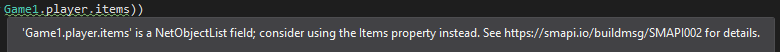

The **mod build package** is an open-source NuGet package which automates the MSBuild configuration
for SMAPI mods and related tools. The package is fully compatible with Linux, Mac, and Windows.

## Contents
* [Use](#use)
* [Features](#features)
  * [Detect game path](#detect-game-path)
  * [Add assembly references](#add-assembly-references)
  * [Copy files into the `Mods` folder and create release zip](#copy-files-into-the-mods-folder-and-create-release-zip)
  * [Launch or debug game](#launch-or-debug-game)
  * [Preconfigure common settings](#preconfigure-common-settings)
  * [Add code warnings](#add-code-warnings)
* [Code warnings](#code-warnings)
* [Special cases](#special-cases)
  * [Custom game path](#custom-game-path)
  * [Non-mod projects](#non-mod-projects)
* [Release notes](#release-notes)

## Use
1. Create an empty library project.
2. Reference the [`Pathoschild.Stardew.ModBuildConfig` NuGet package](https://www.nuget.org/packages/Pathoschild.Stardew.ModBuildConfig).
3. [Write your code](https://stardewvalleywiki.com/Modding:Creating_a_SMAPI_mod).
4. Compile on any platform.
5. Run the game to play with your mod.

## Features
The package automatically makes the changes listed below. In some cases you can configure how it
works by editing your mod's `.csproj` file, and adding the given properties between the first
`<PropertyGroup>` and `</PropertyGroup>` tags.

### Detect game path
The package finds your game folder by scanning the default install paths and Windows registry. It
adds two MSBuild properties for use in your `.csproj` file if needed:

property | description
-------- | -----------
`$(GamePath)` | The absolute path to the detected game folder.
`$(GameExecutableName)` | The game's executable name for the current OS (`Stardew Valley` on Windows, or `StardewValley` on Linux/Mac).

If you get a build error saying it can't find your game, see [_set the game path_](#set-the-game-path).

### Add assembly references
The package adds assembly references to SMAPI, Stardew Valley, xTile, and MonoGame (Linux/Mac) or XNA
Framework (Windows). It automatically adjusts depending on which OS you're compiling it on.

The assemblies aren't copied to the build output, since mods loaded by SMAPI won't need them. For
non-mod projects like unit tests, you can set this property:
```xml
<CopyModReferencesToBuildOutput>true</CopyModReferencesToBuildOutput>
```

If your mod uses [Harmony](https://github.com/pardeike/Harmony) (not recommended for most mods),
the package can add a reference to SMAPI's Harmony DLL for you:
```xml
<EnableHarmony>true</EnableHarmony>
```

### Copy files into the `Mods` folder and create release zip
<dl>
<dt>Files considered part of your mod</dt>
<dd>

These files are selected by default: `manifest.json`,
[`i18n` files](https://stardewvalleywiki.com/Modding:Translations) (if any), the `assets` folder
(if any), and all files in the build output. You can select custom files by [adding them to the
build output](https://stackoverflow.com/a/10828462/262123). (If your project references another mod,
make sure the reference is [_not_ marked 'copy local'](https://msdn.microsoft.com/en-us/library/t1zz5y8c(v=vs.100).aspx).)

You can deselect a file by removing it from the build output. For a default file, you can set the
property below to a comma-delimited list of regex patterns to ignore. For crossplatform
compatibility, you should replace path delimiters with `[/\\]`.

```xml
<IgnoreModFilePatterns>\.txt$, \.pdf$, assets[/\\]paths.png</IgnoreModFilePatterns>
```

</dd>
<dt>Copy files into the `Mods` folder</dt>
<dd>

The package copies the selected files into your game's `Mods` folder when you rebuild the code,
with a subfolder matching the mod's project name.

You can change the folder name:
```xml
<ModFolderName>YourModName</ModFolderName>
```

Or disable deploying the files:
```xml
<EnableModDeploy>false</EnableModDeploy>
```

</dd>
<dt>Create release zip</dt>
<dd>

The package adds a zip file in your project's `bin` folder when you rebuild the code, in the format
recommended for sites like Nexus Mods. The zip filename can be changed using `ModFolderName` above.

You can change the folder path where the zip is created:
```xml
<ModZipPath>$(SolutionDir)\_releases</ModZipPath>
```

Or disable zip creation:
```xml
<EnableModZip>false</EnableModZip>
```

</dd>
</dl>

### Launch or debug game
On Windows only, the package configures Visual Studio so you can launch the game and attach a
debugger using _Debug > Start Debugging_ or _Debug > Start Without Debugging_. This lets you [set
breakpoints](https://docs.microsoft.com/en-us/visualstudio/debugger/using-breakpoints?view=vs-2019)
in your code while the game is running, or [make simple changes to the mod code without needing to
restart the game](https://docs.microsoft.com/en-us/visualstudio/debugger/edit-and-continue?view=vs-2019).

This is disabled on Linux/Mac due to limitations with the Mono wrapper.

To disable game debugging (only needed for some non-mod projects):

```xml
<EnableGameDebugging>false</EnableGameDebugging>
```

### Preconfigure common settings
The package automatically enables PDB files, so error logs show line numbers for simpler debugging.

For projects using the simplified `.csproj` format, it also enables the GAC (to support XNA
Framework) and sets the build to x86 mode (to avoid 'mismatch between the processor architecture' warnings due to
  the game being x86).

### Add code warnings
The package runs code analysis on your mod and raises warnings for some common errors or pitfalls.
See [_code warnings_](#code-warnings) for more info.

## Code warnings
### Overview
The NuGet package adds code warnings in Visual Studio specific to Stardew Valley. For example:  


You can hide the warnings using the warning ID (shown under 'code' in the Error List). See...
* [for specific code](https://docs.microsoft.com/en-us/dotnet/csharp/language-reference/preprocessor-directives/preprocessor-pragma-warning);
* for a method using this attribute:
  ```cs
  [System.Diagnostics.CodeAnalysis.SuppressMessage("SMAPI.CommonErrors", "AvoidNetField")]
  ```
* for an entire project:
  1. Expand the _References_ node for the project in Visual Studio.
  2. Right-click on _Analyzers_ and choose _Open Active Rule Set_.
  4. Expand _StardewModdingAPI.ModBuildConfig.Analyzer_ and uncheck the warnings you want to hide.

See below for help with each specific warning.

### Avoid implicit net field cast
Warning text:
> This implicitly converts '{{expression}}' from {{net type}} to {{other type}}, but
> {{net type}} has unintuitive implicit conversion rules. Consider comparing against the actual
> value instead to avoid bugs.

Stardew Valley uses net types (like `NetBool` and `NetInt`) to handle multiplayer sync. These types
can implicitly convert to their equivalent normal values (like `bool x = new NetBool()`), but their
conversion rules are unintuitive and error-prone. For example,
`item?.category == null && item?.category != null` can both be true at once, and
`building.indoors != null` can be true for a null value.

Suggested fix:
* Some net fields have an equivalent non-net property like `monster.Health` (`int`) instead of
  `monster.health` (`NetInt`). The package will add a separate [AvoidNetField](#avoid-net-field) warning for
  these. Use the suggested property instead.
* For a reference type (i.e. one that can contain `null`), you can use the `.Value` property:
  ```c#
  if (building.indoors.Value == null)
  ```
  Or convert the value before comparison:
  ```c#
  GameLocation indoors = building.indoors;
  if(indoors == null)
     // ...
  ```
* For a value type (i.e. one that can't contain `null`), check if the object is null (if applicable)
  and compare with `.Value`:
  ```cs
  if (item != null && item.category.Value == 0)
  ```

### Avoid net field
Warning text:
> '{{expression}}' is a {{net type}} field; consider using the {{property name}} property instead.

Your code accesses a net field, which has some unusual behavior (see [AvoidImplicitNetFieldCast](#avoid-implicit-net-field-cast)).
This field has an equivalent non-net property that avoids those issues.

Suggested fix: access the suggested property name instead.

### Avoid obsolete field
Warning text:
> The '{{old field}}' field is obsolete and should be replaced with '{{new field}}'.

Your code accesses a field which is obsolete or no longer works. Use the suggested field instead.

## Special cases
### Custom game path
The package usually detects where your game is installed automatically. If it can't find your game
or you have multiple installs, you can specify the path yourself. There's two ways to do that:

* **Option 1: global game path (recommended).**  
  _This will apply to every project that uses the package._

  1. Get the full folder path containing the Stardew Valley executable.
  2. Create this file:
  
     platform  | path
     --------- | ----
     Linux/Mac | `~/stardewvalley.targets`
     Windows   | `%USERPROFILE%\stardewvalley.targets`

  3. Save the file with this content:

     ```xml
     <Project xmlns="http://schemas.microsoft.com/developer/msbuild/2003">
        <PropertyGroup>
          <GamePath>PATH_HERE</GamePath>
        </PropertyGroup>
     </Project>
     ```

  4. Replace `PATH_HERE` with your game path.

* **Option 2: path in the project file.**  
  _You'll need to do this for each project that uses the package._

  1. Get the folder path containing the Stardew Valley `.exe` file.
  2. Add this to your `.csproj` file under the `<Project` line:

     ```xml
     <PropertyGroup>
       <GamePath>PATH_HERE</GamePath>
     </PropertyGroup>
     ```

  3. Replace `PATH_HERE` with your custom game install path.

The configuration will check your custom path first, then fall back to the default paths (so it'll
still compile on a different computer).

You access the game path via `$(GamePath)` in MSBuild properties, if you need to reference another
file in the game folder.

### Non-mod projects
You can use the package in non-mod projects too (e.g. unit tests or framework DLLs). Just disable
the mod-related package features:

```xml
<EnableGameDebugging>false</EnableGameDebugging>
<EnableModDeploy>false</EnableModDeploy>
<EnableModZip>false</EnableModZip>
```

If you need to copy the referenced DLLs into your build output, add this too:
```xml
<CopyModReferencesToBuildOutput>true</CopyModReferencesToBuildOutput>
```

## Release notes
### Upcoming release
* Updated for SMAPI 3.0 and Stardew Valley 1.4.
* Added automatic support for `assets` folders.
* Added `$(GameExecutableName)` MSBuild variable.
* Added support for projects using the simplified `.csproj` format:
  * platform target is now set to x86 automatically to avoid mismatching platform target warnings;
  * added GAC to assembly search paths to fix references to XNA Framework.
* Added option to disable game debugging config.
* Added `.pdb` files to builds by default (to enable line numbers in error stack traces).
* Added optional Harmony reference.
* Fixed `Newtonsoft.Json.pdb` included in release zips when Json.NET is referenced directly.
* Fixed `<IgnoreModFilePatterns>` not working for `i18n` files.
* Dropped support for older versions of SMAPI and Visual Studio.

### 2.2
* Added support for SMAPI 2.8+ (still compatible with earlier versions).
* Added default game paths for 32-bit Windows.
* Fixed valid manifests marked invalid in some cases.

### 2.1
* Added support for Stardew Valley 1.3.
* Added support for non-mod projects.
* Added C# analyzers to warn about implicit conversions of Netcode fields in Stardew Valley 1.3.
* Added option to ignore files by regex pattern.
* Added reference to new SMAPI DLL.
* Fixed some game paths not detected by NuGet package.

### 2.0.2
* Fixed compatibility issue on Linux.

### 2.0.1
* Fixed mod deploy failing to create subfolders if they don't already exist.

### 2.0
* Added: mods are now copied into the `Mods` folder automatically (configurable).
* Added: release zips are now created automatically in your build output folder (configurable).
* Added: mod deploy and release zips now exclude Json.NET automatically, since it's provided by SMAPI.
* Added mod's version to release zip filename.
* Improved errors to simplify troubleshooting.
* Fixed release zip not having a mod folder.
* Fixed release zip failing if mod name contains characters that aren't valid in a filename.

### 1.7.1
* Fixed issue where i18n folders were flattened.
* The manifest/i18n files in the project now take precedence over those in the build output if both
  are present.

### 1.7
* Added option to create release zips on build.
* Added reference to XNA's XACT library for audio-related mods.

### 1.6
* Added support for deploying mod files into `Mods` automatically.
* Added a build error if a game folder is found, but doesn't contain Stardew Valley or SMAPI.

### 1.5
* Added support for setting a custom game path globally.
* Added default GOG path on Mac.

### 1.4
* Fixed detection of non-default game paths on 32-bit Windows.
* Removed support for SilVerPLuM (discontinued).
* Removed support for overriding the target platform (no longer needed since SMAPI crossplatforms
  mods automatically).

### 1.3
* Added support for non-default game paths on Windows.

### 1.2
* Exclude game binaries from mod build output.

### 1.1
* Added support for overriding the target platform.

### 1.0
* Initial release.
* Added support for detecting the game path automatically.
* Added support for injecting XNA/MonoGame references automatically based on the OS.
* Added support for mod builders like SilVerPLuM.
